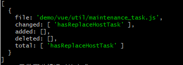
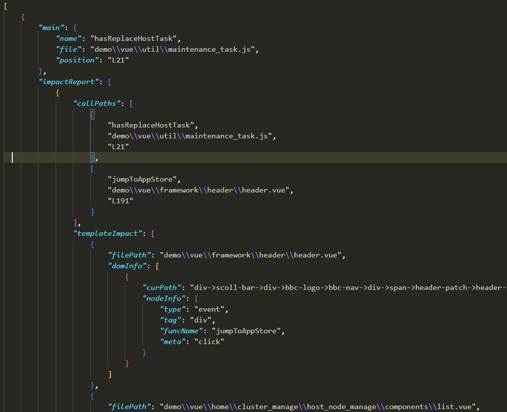
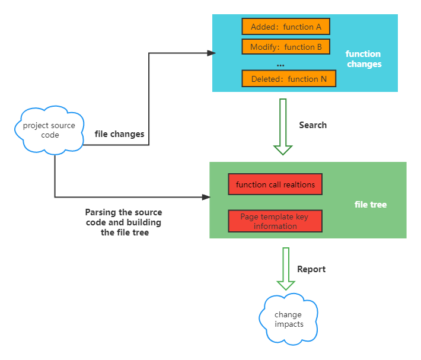

English | [中文](./docs/README_CN.md)

## coderfly

Find function-level association impacts of code changes.

## Background

When you modify the code of a large project, it may not be very clear whether it will have an impact on the functionality.Our self-test may not be enough, and we need to search a lot of related code to determine the impact of the change. Wouldn't it save a lot of time and improve the quality of self-testing if there was a tool that could identify your changes and automatically find out what you affected by the change? That's the problem this project is trying to solve.

It can analyze the changes of the function by the changes of the file.



Then we analyze the impact of this function from the whole project. From the picture blow(a part of the result), we can see that this function is called by `jumpToAppStore` and affects the click event bound to a dom node of `header.vue`.



You can check [how it works](#how-it-works) from here.

## Install

This project is still under development and has not been published to the npm yet. So you can use the built files for now.

- `clone` this project
- `yarn install`
- `yarn build`

## Usage

**Using the API**

see the [API](#api) or [Example](#example).

**Using the command line**

> Not yet finished

- [ ] Using command line: `cci check <folder path>`

## API

### diff

Get the changes of the function by the changes of the file.

If you changed `test/a.js`, you can get the following result by diff.

```js
{
    file: 'test/a.js',
    changed: ['getSum'],
    added: [],
    deleted: ['getData'],
    total: ['getSum', 'getData']
}
```

### getAllFiles

Get all files from source code, filter by default for non-`.vue`、`.js`、`.ts` files.

**Params**

- folderPath: string. It's source code folder path.

### getFuncTree

Analyze the project and build a 「file tree」.

**Params**

- files: string[]. All the files from folder path
- options: Options

```ts
interface Options {
    alias?: {
        [aliasName: string]: string  // alias name and path
    };
}
```

### getImpacts**

Get the impact of changes.

**Params**

- treeData: FileInfoTree. It's file tree.
- funcInfo: ImpactReason. It's the entry function that we get by diff.

```ts
interface ImpactReason {
    filePath: string;
    name: string;
}
```

## Example

```js
import { diff, getAllFiles, getFuncTree, getImpacts } from "coderfly";

// diff
const functionDiffInfo = diff();

// get all files
const files = getAllFiles(path.resolve(process.cwd(), targetDir));

// build file tree
const tree = getFuncTree(files, {
    alias: {
        src: path.resolve(process.cwd(), './demo/vue')
    }
});

// get impacts
// here is just a example, in the real word the second argument needs constructed using the result of diff()
let impacts = getImpacts(tree, {
    filePath: 'src/utils/a.js',
    name: 'getSum'
});

console.log(impacts);
```

## Support

- [x] JavaScript
- [x] Vue2
- [ ] Vue3
- [ ] TypeScript

## how it works



## License

MIT License