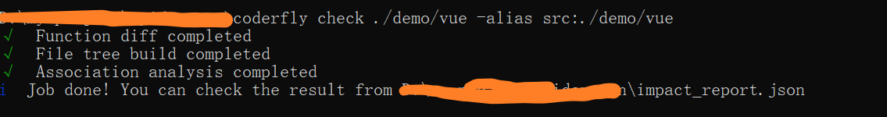

English | [中文](./docs/README_CN.md)

## coderfly

Find function-level association impacts of code changes.

## Background

When you modify the code of a large project, it may not be very clear whether it will have an impact on the functionality.Our self-test may not be enough, and we need to search a lot of related code to determine the impact of the change. Wouldn't it save a lot of time and improve the quality of self-testing if there was a tool that could identify your changes and automatically find out what you affected by the change? 

That's the problem this project is trying to solve.

It can analyze the changes of the function by the changes of the file.


Then we analyze the impact of this function from the whole project. From the picture blow(a part of the result), we can see that this function is called by `jumpToAppStore` and affects the click event bound to a dom node of `header.vue`.


You can check [how it works](#how-it-works) from here.

## Install

This project is still under development and has not been published to the npm yet. So you can use the built files for now.

- `clone` this project
- `yarn install`
- `yarn build`

## Usage

**Using the command line**

`coderfly check <folder path>`

Options:

- `alias`: Set path alias, alias and path should be linked with a **colon**. eg: `coderfly check ./src -alias src:./src static:./public`

- `t` or `tree`: Export the file tree to a file, the file defaults to `file_tree.json`. eg: `coderfly check ./src -t`

Configuration file:

You can also write configuration file named `.coderflyrc.js`, mainly to simplify alias. 

```js
// .coderflyrc.js
const path = require('path');
module.exports = {
    'src': path.resolve(__dirname, 'test'),
    // ...
}
```
> The results are written to the impact_report.json file in the directory where the command was executed



**Using the API**

see the [API](#api) or [Example](#example).
## API

### coderfly

The API for the complete process is included, use this for a one-step process.

**Params**

- srcPath: string. It's source code folder path

## Example

**Easy to use**

```js
const { coderfly } = require('coderfly');

coderfly('./src');
```
## Support

- [x] JavaScript
- [x] Vue2
- [x] TypeScript
- [x] Vue3

## how it works


## License

MIT License