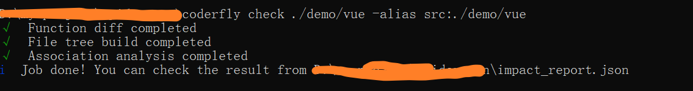
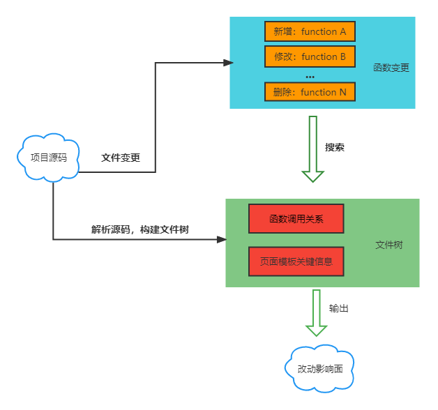

[English](../README.md) | 中文

## coderfly

函数级别的代码改动关联影响分析

## 背景

当我们修改一个大型项目的代码时，也许不是很清楚它是否会对其他模块产生影响。我们的自测可能会出现漏测，而且需要搜索许多相关代码来判断改动影响。如果有个工具，它可以识别你的修改，自动的给你找出你这个修改影响了哪些地方，是不是可以节省很多时间同时也提高自测质量呢？这就是这个项目想要解决的问题。

它可以通过文件的改动，分析函数的变化情况。


然后从整个项目中分析出该函数的影响面，从下图（结果的部分截取）中可以看出这个函数被 jumpToAppStore 所调用，影响了 header.vue 中的某个 dom 节点绑定的 click 事件。


你可以从这里查看[它是如何工作](#如何工作的)的。

## 安装

该项目还在开发中，暂时未发布到 npm 平台，因此无法使用 npm 进行安装。可以先使用打包后的文件。

- `clone` 本项目
- `yarn install`
- `yarn build`

## 使用

**使用命令行**

`coderfly check <folder path>`

参数:

- `alias`: 设置路径别名, 别名和路径要以 **:** 连接。示例： `coderfly check ./src -alias src:./src static:./public`

- `t` 或者 `tree`: 将文件树以文件形式输出，默认为 `file_tree.json`。 示例： `coderfly check ./src -t`

配置文件：

你也可以编写 `.coderflyrc.js` 配置文件，这样更方便 alias 的书写。

```js
// .coderflyrc.js
const path = require('path');
module.exports = {
    'src': path.resolve(process.cwd(), 'test'),
    // ...
}
```

> 分析结果会写入在执行命令的目录下的 impact_report.json 文件中



**使用 API**

可以参考 [API](#api) 或者[示例代码](#示例)

## API 

### coderfly

API集大成者，如果不需要自己字定义过程，用这个一步到位即可.

**Params**

- srcPath: string，源码文件夹路径

## 示例

```js
const { coderfly } = require('coderfly');

coderfly('./src');
```

## 支持

- [x] JavaScript
- [x] Vue2
- [x] TypeScript
- [x] Vue3

## 如何工作的



## 协议

MIT License