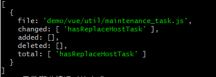
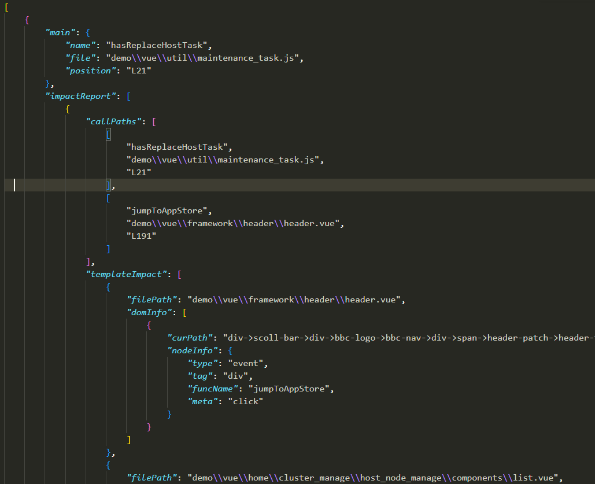

[English](../README.md) | 中文

## coderfly

函数级别的代码改动关联影响分析

## 背景

当我们修改一个大型项目的代码时，也许不是很清楚它是否会对其他模块产生影响。我们的自测可能会出现漏测，而且需要搜索许多相关代码来判断改动影响。如果有个工具，它可以识别你的修改，自动的给你找出你这个修改影响了哪些地方，是不是可以节省很多时间同时也提高自测质量呢？这就是这个项目想要解决的问题。

它可以通过文件的改动，分析函数的变化情况。



然后从整个项目中分析出该函数的影响面，从下图（结果的部分截取）中可以看出这个函数被 jumpToAppStore 所调用，影响了 header.vue 中的某个 dom 节点绑定的 click 事件。



你可以从这里查看[它是如何工作](#如何工作的)的。

## 安装

该项目还在开发中，暂时未发布到 npm 平台，因此无法使用 npm 进行安装。可以先使用打包后的文件。

- `clone` 本项目
- `yarn install`
- `yarn build`

## 使用

**使用命令行**

`coderfly check <folder path>`

参数:

- `alias`: 设置路径别名, 别名和路径要以 **:** 连接。示例： `coderfly check ./src -alias src:./src static:./public`

- `t` 或者 `tree`: 将文件树以文件形式输出，默认为 `file_tree.json`。 示例： `coderfly check ./src -t`


**使用 API**

可以参考 [API](#api) 或者[示例代码](#示例)

## API 

### diff

根据本地文件变动，输出函数修改情况。

假如修改了 `test/a.js`，通过 diff 可以获得下面的结果

```js
{
    file: 'test/a.js',
    changed: ['getSum'],
    added: [],
    deleted: ['getData'],
    total: ['getSum', 'getData']
}
```

### getAllFiles

获取项目所有文件，默认过滤非 `.vue`、`.js`、`.ts` 文件

**Params**

- folderPath: string，源码文件夹路径

### getFuncTree

分析项目文件，构建「文件树」

**Params**

- files: string[], 所有源码文件
- options: Options, 配置

```ts
interface Options {
    alias?: {
        [aliasName: string]: string  // alias name and path
    };
}
```

### getImpacts

分析改动影响

**Params**

- treeData: FileInfoTree, 文件树数据
- funcInfo: ImpactReason, 被搜索的入口函数

```ts
interface ImpactReason {
    filePath: string;
    name: string;
}
```

## 示例

```js
import { diff, getAllFiles, getFuncTree, getImpacts } from "coderfly";

// diff
const functionDiffInfo = diff();

// 获取所有文件信息
const files = getAllFiles(path.resolve(process.cwd(), targetDir));

// 构建文件树
const tree = getFuncTree(files, {
    alias: {
        src: path.resolve(process.cwd(), './demo/vue')
    }
});

// 输出改动影响
// 这里使用一个示例来说明，真实情况下需要使用 diff() 的返回结果来构造 getImpacts 的第二个参数
let impacts = getImpacts(tree, {
    filePath: 'src/utils/a.js',
    name: 'getSum'
});

console.log(impacts);
```

## 支持

- JavaScript
- Vue2
- [ ] Vue3
- [ ] TypeScript

## 如何工作的


## 协议

MIT License